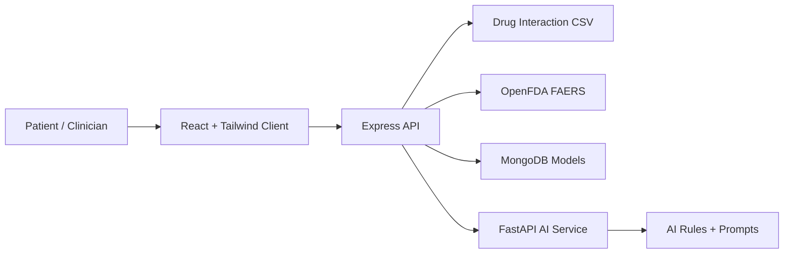

# Architecture Diagram

```mermaid
flowchart LR
  User["Patient / Clinician"] --> Client["React + Tailwind Client"]
  Client --> Server["Express API"]
  Server --> CSV["Drug Interaction CSV"]
  Server --> OpenFDA["OpenFDA FAERS"]
  Server --> Mongo["MongoDB Models"]
  Server --> AI["FastAPI AI Service"]
  AI --> Rules["AI Rules + Prompts"]
```
