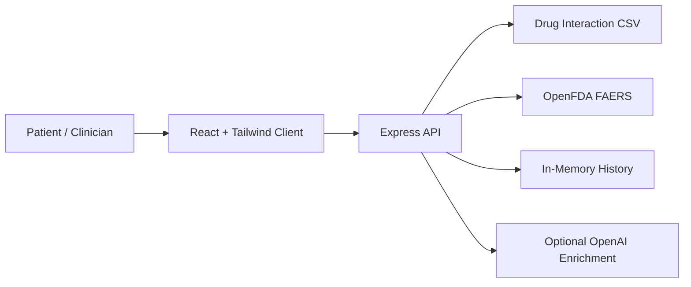

# Architecture Diagram

```mermaid
flowchart LR
  User["Patient / Clinician"] --> Client["React + Tailwind Client"]
  Client --> Server["Express API"]
  Server --> CSV["Drug Interaction CSV"]
  Server --> OpenFDA["OpenFDA FAERS"]
  Server --> Memory["In-Memory History"]
  Server --> OpenAI["Optional OpenAI Enrichment"]
```
